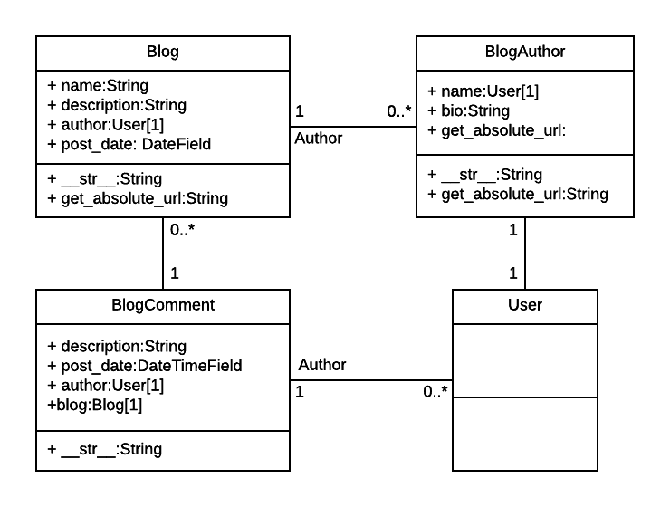

# Django DIY Blog
Basic blog site written in Django (part of MDN Django module assessment)
----
This web application creates an very basic blog site using Django. The site allows blog authors to create text-only blogs using the Admin site, and any logged in user to add comments via a form. Any user can list all bloggers, all blogs, and detail for bloggers and blogs (including comments for each blog).

The models for this site are as shown below:




For more information see the associated [MDN assessment page](https://developer.mozilla.org/en-US/docs/Learn/Server-side/Django/django_assessment_blog).


## Quick Start

To get this project up and running locally on your computer:
1. Set up the [Python development environment](https://developer.mozilla.org/en-US/docs/Learn/Server-side/Django/development_environment).
   We recommend using a Python virtual environment.
1. Assuming you have Python setup, run the following commands (if you're on Windows you may use `py` or `py -3` instead of `python3` to start Python):
   ```
   pip3 install -r requirements.txt
   python3 manage.py makemigrations
   python3 manage.py migrate
   python3 manage.py collectstatic
   python3 manage.py test # Run the standard tests. These should all pass.
   python3 manage.py createsuperuser # Create a superuser
   python3 manage.py runserver
   ```
1. Open a browser to `http://127.0.0.1:8000/admin/` to open the admin site
1. Create a few test objects of each type.
1. Open tab to `http://127.0.0.1:8000` to see the main site, with your new objects.
